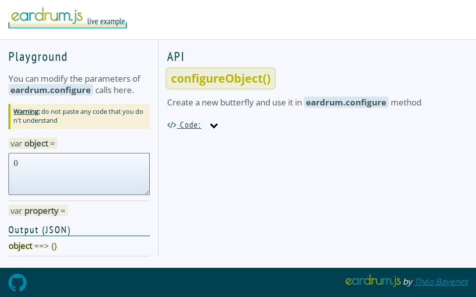

# eardrum.js

A Javascript library that binds event listeners to object properties


## Basic API
Documentation in progress ...

## Use case examples

```js
const app = {
	// ...
	appErrorLogger: null
};

eardrum.watch({
	object: app,
	property: 'appErrorLogger',
	listener: {
		target: window,
		type: 'error'
	}
});
// No event listener is added so far,
// but eardrum watches appErrorLogger property

// Assigning a function to watched property
app.appErrorLogger = function logger (event) {
	console.log(event);
};
// ==> eardrum adds an event listener
// (logger will be used to handle onerror events)

// Assigning back non function value to wached property
app.appErrorLogger = null;
// ==> Event listener is removed by eardrum
```
